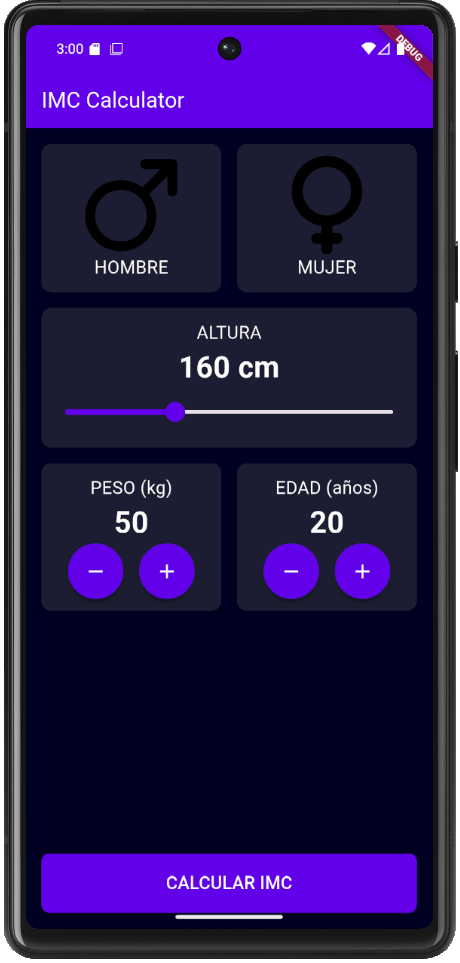

# IMC Calculator

Calculadora de Índice de Masa Corporal (IMC) creada con Flutter y Dart.

**Descripción**

Aplicación simple para calcular el IMC según peso y altura, mostrar el resultado y una interpretación básica. Ideal como proyecto de práctica con Flutter.

**Características**

- Selección de género
- Selección de altura mediante control deslizante
- Incremento/decremento de peso y edad
- Pantalla de resultado con interpretación del IMC

**Capturas**

Capturas de pantalla (se mostrarán en GitHub usando rutas relativas):




Otras imágenes del proyecto:

- 
- 

**Requisitos**

- Flutter SDK (recomendado Flutter 2.10+ o superior)
- Dart (incluido con Flutter)
- Android Studio / VS Code (opcional para desarrollo)

**Instalación**

1. Clona el repositorio:

```bash
git clone <URL_DEL_REPOSITORIO>
cd imc_calculator
```

2. Obtén las dependencias:

```bash
flutter pub get
```

**Ejecutar la app**

Para ejecutar en un dispositivo conectado o emulador:

```bash
flutter run
```

Para compilar un APK de lanzamiento (Android):

```bash
flutter build apk --release
```

Para web:

```bash
flutter run -d chrome
```

**Estructura del proyecto**

- `lib/main.dart` — Punto de entrada de la aplicación
- `lib/screens/` — Pantallas (`imc_home_screen.dart`, `imc_result_screen.dart`)
- `lib/components/` — Widgets reutilizables (`gender_selector.dart`, `height_selector.dart`, `number_selector.dart`)
- `assets/images/` — Imágenes y recursos gráficos
